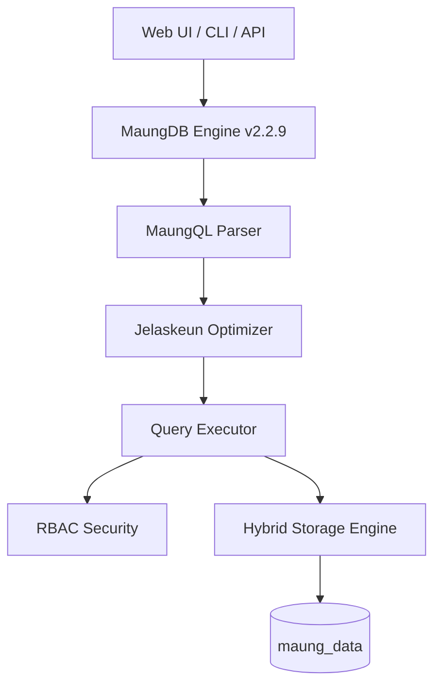

# 🐯 MaungDB Enterprise Edition


**MaungDB v2.2.9** adalah *Database Management System* (DBMS) Hybrid berperforma tinggi berbasis **Golang**. Menggabungkan fleksibilitas NoSQL (Flat-file storage) dengan integritas RDBMS (Strict Schema & ACID), MaungDB mengusung kearifan lokal dengan sintaks berbasis Bahasa Sunda untuk edukasi dan efisiensi tingkat tinggi.

> *"Database buatan urang, pikeun dunya."*

---

## 🏗️ Arsitektur & Konsep Internal

MaungDB menggunakan pendekatan **Hybrid Storage Engine** untuk menjamin durabilitas dan kecepatan:

* **Data (`.mg`):** Penyimpanan baris fisik *Append-Only log structure*. Kolom dipisahkan pipa (`|`).
* **Index (`.idx`):** *Hash Map binary* di memori untuk pencarian data eksak dengan kompleksitas **O(1)**.
* **WAL (`.log`):** *Write-Ahead Logging* untuk menjamin data tetap aman (ACID) jika terjadi *crash*.
* **View (`.view`):** Logika tabel virtual (Kaca) yang dijalankan secara *lazy*.



---

## 🚀 Fitur Utama v2.2.9

1. **Virtual Views (Kaca):** Menyimpan query kompleks sebagai tabel virtual menggunakan keyword `DAMEL KACA`.
2. **Database Discovery:** Navigasi lintas database secara instan dengan `TINGALI PANGKAL`.
3. **Event Triggers (Jarambah):** Automasi logika cerdas yang berjalan otomatis setelah operasi data terjadi.
4. **Query Optimizer (Jelaskeun):** Analisa rencana eksekusi dan estimasi biaya (*cost*) query untuk optimasi.
5. **Replikasi HA:** Arsitektur ketersediaan tinggi dengan mode **Indung (Master)** dan **Anak (Slave)**.
6. **Full Text Search (Korehan):** Pencarian teks canggih pada kolom besar menggunakan *Inverted Index*.

---

## ⚡ Instalasi & Inisialisasi

Cukup jalankan satu baris perintah untuk instalasi otomatis (Linux/Mac):

```bash
curl -fsSL https://raw.githubusercontent.com/febrd/maungdb/main/installer.sh | bash

```

### Inisialisasi Sistem

Setelah terpasang, siapkan folder data sistem (kandang maung):

```bash
maung init
# Output: ✅ MaungDB siap diangge
# Default user: maung / maung (Role: supermaung)

```

### Menjalankan Server

```bash
maung server 7070
# Akses Dashboard: http://localhost:7070

```

---

## 🔐 Keamanan & Role (RBAC)

| Role | Deskripsi & Hak Akses |
| --- | --- |
| **`supermaung`** | God Mode. Akses penuh ke sistem, user, dan seluruh database. |
| **`admin`** | Schema Manager. Mengelola DDL (Table/Index) tapi tidak bisa kelola user. |
| **`user`** | Data Operator. Hanya diizinkan melakukan CRUD data (DML/DQL). |

---

## 📜 Kamus MaungQL v2.2.9

### ➤ Operasi Dasar

* **DAMEL**: Membuat Tabel (`DAMEL mhs id:INT:PK, nama:STRING`)
* **SIMPEN**: Insert Data (`SIMPEN mhs 1|Asep`)
* **TINGALI**: Select Data (`TINGALI * TI mhs DIMANA id=1`)
* **OMEAN / JANTEN**: Update Data (`OMEAN mhs JANTEN nama=Budi DIMANA id=1`)
* **MICEUN**: Delete Data (`MICEUN TI mhs DIMANA id=1`)

### ➤ Enterprise & Relasi

* **GABUNG / HIJIKEUN**: Inner Join antar tabel.
* **KENCA GABUNG**: Left Join.
* **KATUHU GABUNG**: Right Join.
* **JELASKEUN**: Melihat rencana eksekusi query (Explain).
* **TANDAIN**: Membuat Hash Index pada kolom tertentu.
* **KOREHAN**: Melakukan Full Text Search (FTS).

---

## 🛡️ High Availability (Replikasi)

MaungDB Enterprise mendukung sinkronisasi data antar node:

* **JADI INDUNG**: Mengatur node sebagai **Parent/Master** (Menerima R/W).
* **JADI ANAK NGINTIL <ip>**: Mengatur node sebagai **Child/Slave** (Read-Only & Auto-sync).

---

## 🧬 Skenario & Test Cases

### 1. Single Table Operations

```sql
MICEUN TI pegawai;
DAMEL pegawai id:INT:PK,nama:STRING,divisi:ENUM(IT,HRD),gaji:FLOAT;
SIMPEN pegawai 101|Farah|IT|5000000;
OMEAN pegawai JANTEN gaji=8000000 DIMANA id=101;

```

### 2. Relasi Tabel (JOIN)

```sql
DAMEL divisi id:INT:PK,nama:STRING;
DAMEL staff id:INT,nama:STRING,id_div:INT:FK(divisi.id);
SIMPEN divisi 1|Teknologi;
SIMPEN staff 101|Eko|1;
TINGALI staff.nama, divisi.nama TI staff GABUNG divisi DINA staff.id_div = divisi.id;

```

---

## 🛠️ Tech Stack

* **Core Engine**: Go (Golang) 1.21+
* **Dashboard**: ReactJS (Maung Studio Modern UI)
* **Security**: AES-256 Session Encryption
* **Protocol**: HTTP/JSON REST API

---

**Dibuat dengan ❤️ dan ☕ di Bandung, West Java.**
*(c) 2026 MaungDB Inc. - Engineered by Febriansah Dirgantara.*

---

